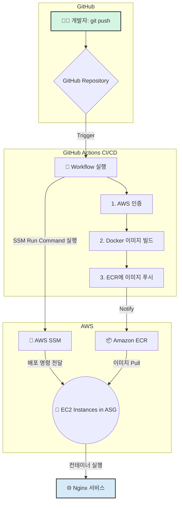

# 🚀 Nginx on ASG: CI/CD Pipeline with GitHub Actions & ECR

이 프로젝트는 GitHub Actions, AWS ECR, AWS SSM을 사용하여 EC2 Auto Scaling Group(ASG)에 Dockerized Nginx 웹 서버를 자동으로 배포하는 완전한 CI/CD(지속적 통합/지속적 배포) 파이프라인을 구축하는 방법을 안내하는 초보자용 가이드입니다.

## ✨ 초보자를 위한 핵심 개념

이 프로젝트를 이해하기 위해 몇 가지 핵심 개념을 알아봅시다.

*   **CI/CD (Continuous Integration/Continuous Deployment)**: 개발자가 코드를 변경하면, 이 변경 사항이 자동으로 테스트되고, 빌드되어, 최종적으로 사용자에게 배포되는 전체 프로세스를 자동화하는 것을 의미합니다. 이 프로젝트에서는 GitHub Actions가 CI/CD 도구로 사용됩니다.
*   **Docker와 ECR (Amazon Elastic Container Registry)**:
    *   **Docker**: 애플리케이션을 모든 환경에서 동일하게 실행될 수 있도록 '컨테이너'라는 독립된 공간에 패키징하는 기술입니다. `Dockerfile`은 이 컨테이너를 만드는 설계도입니다.
    *   **ECR**: Docker로 만든 '컨테이너 이미지'를 안전하게 저장, 관리, 배포할 수 있는 AWS의 비공개 저장소입니다.
*   **ASG (Auto Scaling Group)**: 트래픽 양에 따라 EC2 인스턴스(가상 서버)의 수를 자동으로 늘리거나 줄여주는 AWS의 서비스입니다. 이를 통해 안정적인 서비스 운영과 비용 효율성을 확보할 수 있습니다.
*   **AWS SSM (Systems Manager) `Run Command`**: 여러 EC2 인스턴스에 원격으로 접속하지 않고도 안전하게 명령을 실행하고 관리할 수 있게 해주는 강력한 AWS 서비스입니다. 이 프로젝트에서는 배포 명령을 모든 서버에 한 번에 전달하는 역할을 합니다.

## 🏗️ 아키텍처 다이어그램 (Mermaid)

이 파이프라인의 전체적인 흐름은 다음과 같습니다.



## 🌊 현재 워크플로우 상세 설명

`main` 브랜치에 코드를 푸시하면 `.github/workflows/deploy.yml` 파일에 정의된 워크플로우가 자동으로 실행됩니다.

1.  **트리거**: 개발자가 코드를 `main` 브랜치로 푸시합니다.
2.  **GitHub Actions 시작**: 워크플로우가 시작되고 `ubuntu-latest` 환경에서 작업을 수행합니다.
3.  **AWS 인증**: GitHub에 저장된 Secret(`AWS_ACCESS_KEY_ID` 등)을 사용하여 AWS에 안전하게 로그인합니다.
4.  **Docker 이미지 빌드**: `Dockerfile`을 기반으로 순수한(Generic) Nginx 이미지를 빌드합니다.
5.  **ECR에 이미지 푸시**: 빌드된 이미지에 고유한 태그(commit hash)와 `latest` 태그를 붙여 AWS ECR에 업로드합니다.
6.  **SSM을 통한 배포**: AWS SSM `Run Command`를 사용하여 `deploygroup: container-asg` 태그가 달린 모든 EC2 인스턴스에 다음 스크립트를 실행하도록 명령합니다.
    *   ECR에 로그인합니다.
    *   ECR에서 새로운 버전의 이미지를 내려받습니다 (`docker pull`).
    *   기존에 실행 중이던 `nginx-server` 컨테이너를 중지하고 삭제합니다.
    *   새로운 이미지로 `nginx-server` 컨테이너를 시작합니다.
    *   오래된 Docker 이미지를 정리하여 용량을 확보합니다.

## 🛠️ 사전 준비 및 설정 가이드

이 파이프라인을 실제로 동작시키기 위해 아래의 단계를 따라 설정해주세요.

### 1. AWS 인프라 설정

*   **ECR Repository 생성**:
    *   AWS 콘솔에서 'Elastic Container Registry'로 이동합니다.
    *   `Private` 리포지토리로 하나를 생성합니다. (예: `my-nginx-app`)
    *   생성된 리포지토리의 `URI`를 기록해둡니다. (예: `123456789012.dkr.ecr.ap-northeast-2.amazonaws.com/my-nginx-app`)

*   **IAM Role for EC2 생성**:
    *   AWS IAM 콘솔에서 '역할(Role)' 만들기를 선택하고, 사용 사례로 `EC2`를 선택합니다.
    *   다음 두 개의 AWS 관리형 정책을 연결합니다.
        *   `AmazonEC2RoleforSSM`: EC2가 SSM의 관리를 받을 수 있도록 하는 정책
        *   `AmazonEC2ContainerRegistryReadOnly`: EC2가 ECR에서 이미지를 내려받을 수 있도록 하는 정책
    *   역할 이름을 지정하고 (예: `EC2-SSM-ECR-Role`) 생성합니다.

*   **EC2 인스턴스 (또는 ASG) 실행**:
    *   EC2 콘솔에서 인스턴스를 시작하거나, Auto Scaling Group을 위한 시작 템플릿(Launch Template)을 생성합니다.
    *   **AMI**: `Amazon Linux 2` 또는 `Ubuntu` 등 Docker가 설치 가능한 OS를 선택합니다.
    *   **IAM 인스턴스 프로파일**: 위에서 생성한 `EC2-SSM-ECR-Role`을 적용합니다.
    *   **태그(Tags)**: `Key`는 `deploygroup`, `Value`는 `container-asg`로 태그를 추가해야 합니다. 이 태그가 SSM의 타겟팅 기준이 됩니다.
    *   **User Data (고급)**: 인스턴스가 처음 시작될 때 Docker를 설치하는 스크립트를 추가합니다.
        ```bash
        #!/bin/bash
        # Install Docker
        sudo yum update -y
        sudo amazon-linux-extras install docker -y
        sudo service docker start
        sudo usermod -a -G docker ec2-user
        ```

### 2. GitHub 리포지토리 설정

*   리포지토리의 `Settings > Secrets and variables > Actions` 메뉴로 이동하여 아래 4개의 `Repository secrets`를 추가합니다.
    *   `AWS_ACCESS_KEY_ID`: AWS에 프로그래밍 방식으로 접근 가능한 IAM 사용자의 Access Key ID.
    *   `AWS_SECRET_ACCESS_KEY`: 위 사용자의 Secret Access Key.
    *   `AWS_REGION`: 사용하려는 AWS 리전 (예: `ap-northeast-2`).
    *   `ECR_REPOSITORY`: ECR 리포지토리 이름 (예: `my-nginx-app`). URI 전체가 아닌 이름만 입력합니다.

## 🌟 (중요) 나만의 웹페이지 보여주기

현재 설정은 Nginx의 기본 페이지만 보여줍니다. 우리가 만든 `html/index.html`을 실제로 서비스하려면 `Dockerfile`을 수정해야 합니다.

**방법: `Dockerfile`에 파일 복사 로직 추가**

가장 간단하고 확실한 방법은 Docker 이미지를 빌드할 때 웹사이트 파일들을 함께 복사(COPY)하여 '구워넣는' 것입니다.

1.  아래 내용으로 `Dockerfile`을 **대체**합니다.

    ```dockerfile
    # Use the official Nginx image from Docker Hub
    FROM nginx:latest

    # Remove the default nginx index page
    RUN rm /usr/share/nginx/html/index.html

    # Copy our custom html and configuration files
    COPY ./html/ /usr/share/nginx/html/
    COPY ./default.conf /etc/nginx/conf.d/default.conf
    ```

2.  이 변경 사항을 저장하고 `git push`하면, GitHub Actions는 이제 `index.html`과 `default.conf`가 포함된 새로운 Docker 이미지를 빌드하여 배포합니다. 이제 브라우저에서 서버에 접속하면 우리가 만든 `index.html`의 내용이 보이게 됩니다.

## 📂 파일 설명

*   **`.github/workflows/deploy.yml`**: CI/CD 파이프라인의 모든 자동화 로직이 담긴 파일.
*   **`html/index.html`**: 사용자에게 보여줄 웹페이지의 내용.
*   **`default.conf`**: Nginx 웹 서버의 커스텀 설정 파일.
*   **`Dockerfile`**: Nginx 이미지를 만들기 위한 설계도. 위 가이드에 따라 수정하여 사용하세요.
*   **`README.md`**: 프로젝트 설명서 (바로 이 파일).

이제 모든 설정이 끝났습니다. 코드를 수정하고 `git push`를 실행하여 자동 배포의 마법을 경험해보세요!